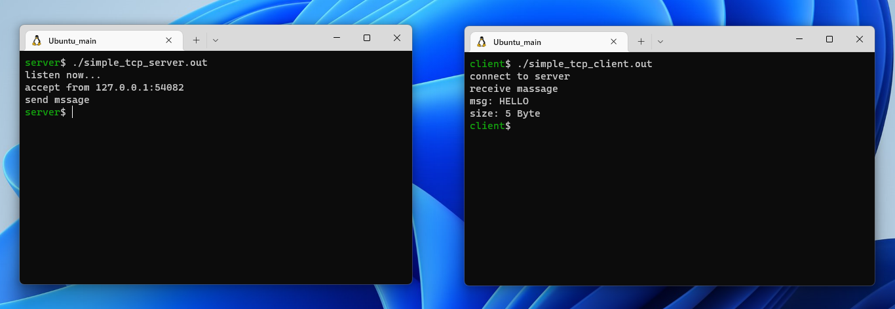

# CSocketProgrammingPractice

C言語でのソケットプログラミングを勉強した際の成果物


## Table of Contents

- [Requirement](#requirement)
- [Usage](#usage)
   - [Install](#install)
   - [Build](#build)
   - [Execution](#execution)
- [Description](#description)
- [Reference](#reference)


<a id="requirement"></a>
## Requirement

- Ubuntu 20.04 (WSL1)
- gcc 9.4.0
- cmake 3.16.3


<a id="usage"></a>
## Usage

<a id="install"></a>
### Install

```bash
$ cd your/workspace/path
$ git clone https://github.com/today2098/CSocketProgrammingPractice.git
```


<a id="build"></a>
### Build

```bash
$ cd CSocketProgrammingPractice
$ ./build.sh
```


<a id="execution"></a>
### Execution

各プロジェクトでは複数ユーザ間でソケット通信を行います．
そのため動作を確認する際は，ターミナルを複数立ち上げ，同時にそれぞれ実行させてください．

例えば "SimpleTcp" の場合，次のようにサーバ用とクライアント用の2つターミナルを用意します．
サーバ側で "simple_tcp_server.out" を実行しサーバを立ち上げた後，クライアント側で "simple_tcp_client.out" を実行し，両者間で通信を行います．

<!--  -->

<div align="center">
  
</div>


<a id="description"></a>
## Description

|Project|Description|Protocol|
|---|---|:---:|
|SimpleTcp|サーバからクライアントへメッセージを送信する．|TCP|
|SimpleFT|クライアントからサーバへファイルデータを送信する．|TCP|
|SimpleUdp|メッセージを送受信する．|UDP|
|UdpEcho|サーバがクライアントから送られるメッセージをそのまま返信する．|UDP|
|Multicast|メッセージをマルチキャストする．|UDP|
|MulticastFT|ファイルデータをマルチキャストする．|UDP|


<a id="reference"></a>
## Reference

1. Michael J.D., Kenneth L.C.著，小高 知宏監訳『TCP/IPソケットプログラミング』オーム社 (2003)．
1. 富永 和人，権藤 克彦著『例解UNIX/Linuxプログラミング教室』オーム社 (2018)．
